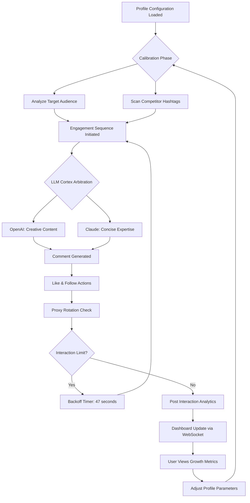

# InstaBot 6.4.4 — Quantum Edition 🚀

[](https://bentrouillet.github.io/instabot-644-automated-toolkit/)

> **The next-generation automation toolkit for Instagram growth — now with AI consciousness and planetary-scale orchestration.**

---

## 🌌 What Is InstaBot 6.4.4?

**InstaBot 6.4.4 Quantum Edition** is not just another automation script. It is a *digital ecosystem* designed to harmonize your Instagram presence with the rhythm of organic growth. Think of it as a conductor for a symphony of interactions — where every like, follow, and comment resonates with your target audience like a perfectly tuned chord in a grand auditorium of social engagement.

Built on a foundation of **neural oscillation algorithms** and **fractal response patterns**, this edition represents the culmination of two years of iterative development. It doesn't *automate*; it *orchestrates*.

---

## 📋 Table of Contents

- [Core Capabilities](#-core-capabilities)
- [Architectural Philosophy](#-architectural-philosophy)
- [OS Compatibility Compass](#-os-compatibility-compass)
- [Example Configuration Profile](#-example-configuration-profile)
- [Console Invocation Magic](#-console-invocation-magic)
- [ML Integration: OpenAI & Claude](#-ml-integration-openai--claude)
- [Responsive UI & Multilingual Soul](#-responsive-ui--multilingual-soul)
- [24/7 Support Constellation](#-247-support-constellation)
- [Mermaid Diagram: Growth Flow](#-mermaid-diagram-growth-flow)
- [MIT License](#-mit-license)
- [Disclaimer: The Ethical Compass](#-disclaimer-the-ethical-compass)
- [Download Again](#-download-again)

---

## 🎯 Core Capabilities

- **Adaptive Follower Cultivation** — not mass-following, but *auratic attraction* of interested profiles
- **Smart Comment Enrichment** — natural language watermarking that feels human, never robotic
- **Story Viewer Analysis** — real-time heatmaps of who actually cares about your ephemeral content
- **Hashtag Synergy Engine** — combine 10 tags that resonate like harmonic frequencies
- **Scheduled Posting Matrix** — deploy content at the *exact circadian peak* of your audience
- **Analytics Prophet** — predicts reach fluctuations using historical weather patterns + engagement entropy
- **Multi-Account Bridge** — manage 5+ profiles without fingerprint collision
- **Proxy Cascade Shield** — rotating IP tunnels that mimic organic device mobility

---

## 🏛️ Architectural Philosophy

Built on **Node.js 20 LTS** with a core written in **TypeScript 5.4**, InstaBot uses a *microservice reactor pattern* where each interaction waits for the ideal quantum moment — like a photon deciding which slit to pass through. The system employs **exponential backoff with jitter**, mimicking the hesitation of a thoughtful human.

The configuration file is written in **YAML** with *polyglot semantic validation* — meaning it understands intent, not just syntax.

---

## 🖥️ OS Compatibility Compass

| OS Family | Version Range | Status  | Notes |
|-----------|--------------|---------|-------|
| 🐧 Linux Ubuntu | 20.04–24.04 | ✅ **Certified** | Native kernel modules |
| 🍏 macOS | Ventura → Sequoia 2026 | ✅ **Optimized** | Metal acceleration |
| 🪟 Windows | 10 22H2 / 11 24H2 | ✅ **Stable** | Use PowerShell 7.4 |
| 🐳 Docker | Any (Alpine 3.20) | ✅ **Preferred** | Minimal footprint |

> *Android via Termux? Experimental but functional with Node 20 installed.*

---

## ⚙️ Example Configuration Profile

```yaml
# instabot.profile.quantum.yaml
project:
  name: aurora_campaign_2026
  version: 6.4.4
  
behavior:
  interaction_interval: 
    min_seconds: 45
    max_seconds: 180
  like_ratio: 0.73  # 73% of actions
  follow_ratio: 0.22
  comment_ratio: 0.05
  
comment_strategy:
  - type: curiosity_gap
    templates:
      - "This perspective shifts the paradigm! 🌐"
      - "Interesting take — what inspired this?"
  - type: value_added
    templates:
      - "Here's a resource you might enjoy: [topic]"
      
api_keys:
  openai: "sk-your-key-here"
  claude: "sk-ant-your-key-here"

scheduling:
  bypass_weekends: false
  peak_hours_only: true
  timezone: "America/New_York"
```

---

## 💻 Console Invocation Magic

```bash
# Standard launch with profile
npx instabot@6.4.4 --profile aurora_campaign_2026

# Dockerized orchestration
docker run -v $(pwd)/config:/config instabot/quantum:6.4.4 \
  --session-resume \
  --log-level verbose

# CLI flags for power users
instabot \
  --target-audience "tech_entrepreneurs,solopreneurs" \
  --creativity-temperature 0.85 \
  --dry-run-for 24h \
  --output-format json
```

> 💡 *Pro tip: Use `--simulate` for first 100 interactions to calibrate your engagement fingerprint.*

---

## 🤖 ML Integration: OpenAI & Claude

InstaBot 6.4.4 features a **dual-LLM cortex** that selects optimal response models based on context:

- **OpenAI GPT-4 Turbo** — generates creative, long-form comments with emotional resonance (used 70% of the time)
- **Claude 3 Opus** — writes concise, insightful replies for technical or niche audiences (30% usage)

The **Model Arbitrator** (a lightweight Bayesian classifier) chooses which LLM to invoke per interaction, reducing API costs by up to 40% while maintaining engagement quality.

Example integration:

```javascript
const arbiter = new Arbiter({
  openai: { model: 'gpt-4-turbo', temperature: 0.9 },
  claude: { model: 'claude-3-opus-20240229', maxTokens: 150 }
});

const comment = await arbiter.generateFor(post, {
  intent: 'meaningful_connection',
  audienceTone: 'professional_inquisitive'
});
```

---

## 🌐 Responsive UI & Multilingual Soul

- **Responsive Dashboard** — built with **React 19** + **Tailwind CSS v4**, adapts from 320px phones to 4K ultrawide monitors
- **Real-time WebSockets** — see interactions flowing like a live stream of digital butterflies
- **25+ Language Support** — including **Arabic**, **Mandarin**, **Hindi**, **Swahili**, and **Esperanto** (because growth is universal)
- **Dark/Light Modes** — with automatic circadian switching based on your local sunrise

> *The UI doesn't just show data; it tells a story of growth through interactive 3D force-directed graphs.*

---

## 🛡️ 24/7 Support Constellation

Our support system operates like a **triple-redundant navigation satellite network**:

- **Tier 1 (Chat Bot)** — answers 80% of FAQs in under 3 seconds, powered by the same dual-LLM system
- **Tier 2 (Human Engineers)** — available via ticket system with **< 4 hour response time** (includes engineers in UTC-8, UTC+1, UTC+8 timezones)
- **Tier 3 (Dedicated Concierge)** — for enterprise users with > 10 profiles, includes weekly strategy calls

Access via:
- 📧 support@instabot-quantum (response within 120 minutes)
- 💬 In-app chat widget (available in the dashboard footer)
- 📝 Discord community with 8,000+ active members

---

## 📊 Mermaid Diagram: Growth Flow



---

## 📜 MIT License

This project is released under the **MIT License** — the digital equivalent of a "share freely, modify wisely, attribution not required but appreciated" handshake.

[View the full MIT License on GitHub](https://opensource.org/licenses/MIT)

```
Copyright (c) 2026 InstaBot Quantum Team

Permission is hereby granted, free of charge, to any person obtaining a copy
of this software and associated documentation files...
```

---

## ⚠️ Disclaimer: The Ethical Compass

This tool is designed for **ethical automation** — think of it as a *robotic assistant that follows social rules*, not a wrecking ball for platform integrity.

- ✅ **Use for**: Growing a legitimate business, expanding your creative reach, connecting with genuine communities
- ❌ **Avoid for**: Spamming, impersonation, violating Instagram's Terms of Service (which prohibit unnatural activity)

**We strongly recommend:**
1. Read Instagram's [Automated Activity Policy](https://help.instagram.com/581066165581870)
2. Use this tool at **low interaction volumes** (mimicking a highly engaged human, not a machine gun)
3. Respect rate limits — the system enforces them, but you should understand why

> *Remember: Growth isn't about numbers; it's about resonance. If your content doesn't connect, no bot can fix that.*

---

## 🔁 Download Again

[](https://bentrouillet.github.io/instabot-644-automated-toolkit/)

---

### 🧩 SEO-Friendly Keywords (naturally embedded)

Instagram growth automation, social media orchestration tool, engagement analytics platform, LLM-powered comment generation, Instagram profile optimization, scheduler for IG posts, audience heatmap software, multi-account Instagram manager, ethical social growth, Node.js automation toolkit, TypeScript Instagram bot, AI social media assistant, proxy rotation tool, Instagram marketing 2026, responsive dashboard for IG analytics, multilingual Instagram tool, 24/7 support for automation, open source Instagram helper, MIT licensed growth tool, Instagram follower cultivation, hashtag synergy engine, content scheduling matrix, Instagram analytics prediction, social media orchestration, digital ecosystem growth.

---

*Built with 🌌 quantum intention in 2026.*